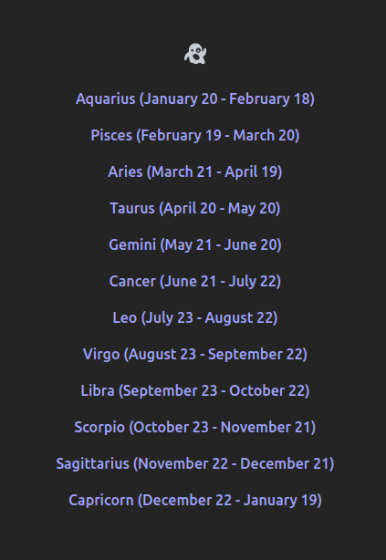
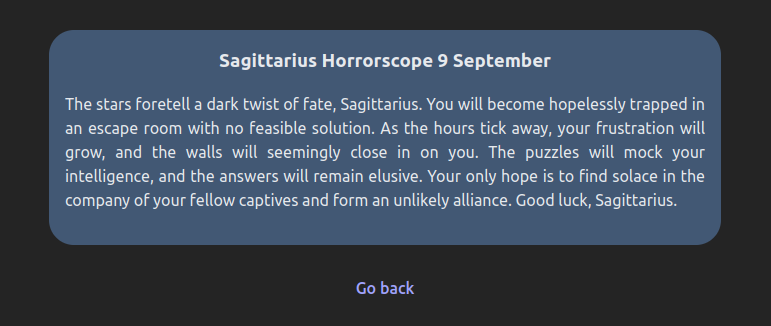
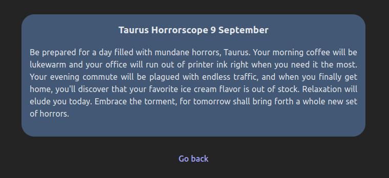
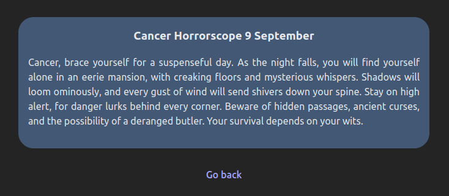
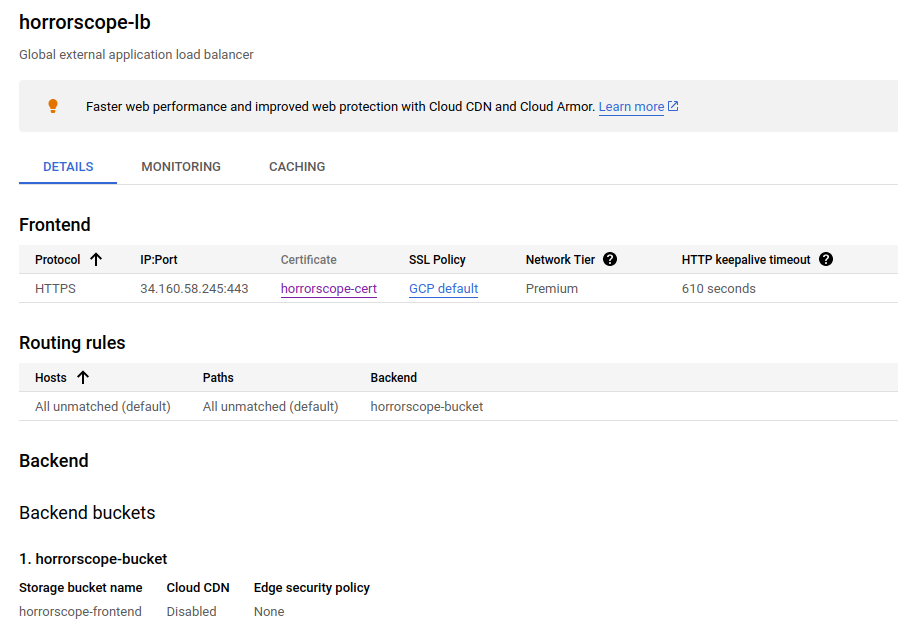
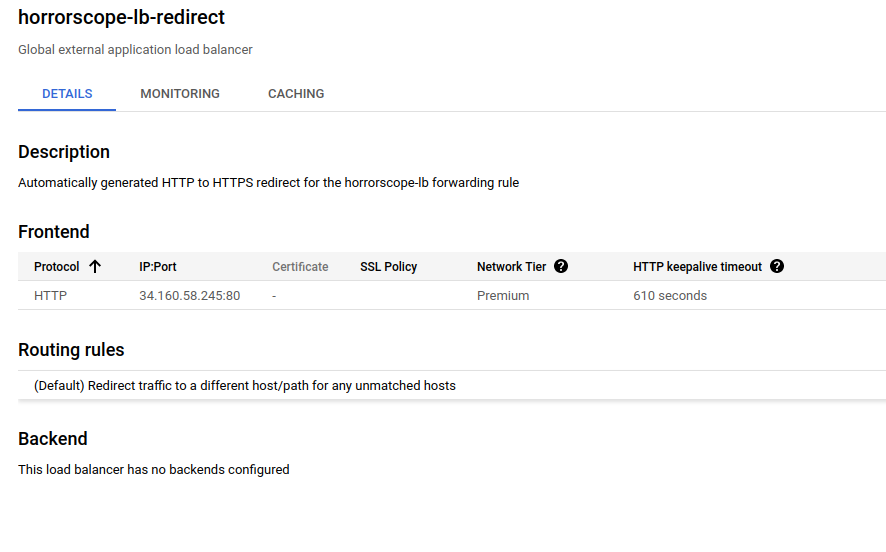

# horrorscopes

Daily horoscopes with a spooky theme.

The idea came from me finding horoscopes funny because of how ridiculously vague they usually are. I wanted to make an
extreme opposite version where they are as specific as possible (i.e. you will spill a banana milkshake on
yor brand new shoes today at 5:36pm), and then it sort of evolved into more horror-related predictions instead
for some reason.

## Project structure

### Author

Script that uses OpenAI's GPT3.5 to generate "horrorscopes", designed to be run once a day.
Stores them in gcloud datastore.

### Api

Simple flask API providing a single endpoint to fetch the horrorscope for a given date and zodiac sign.

### Frontend

Basic website (not using any frameworks) to display a main menu and the day's horrorscope for a given zodiac sign.

---

## Notes to self

I've deleted the gcloud load balancing rules so I don't get charged. They looked like this:

